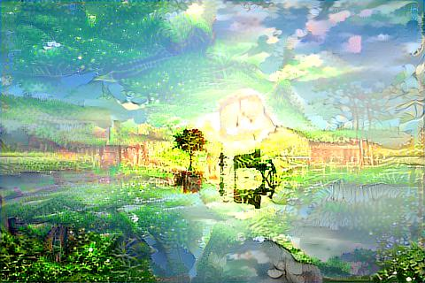
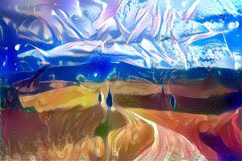
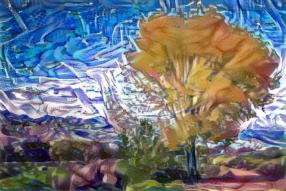
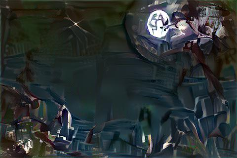
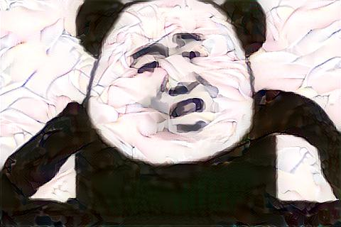

# Neural-Style-Transfer
神经风格迁移 （VGG19）2019-2-23
### VGG19权重下载：
##### https://github.com/fchollet/deep-learning-models/releases/download/v0.1/vgg19_weights_tf_dim_ordering_tf_kernels.h5
##### https://github.com/fchollet/deep-learning-models/releases/download/v0.1/vgg19_weights_tf_dim_ordering_tf_kernels_notop.h5
### 将权重放入weights文件夹，运行main.py
### Demo:
 +  = 

